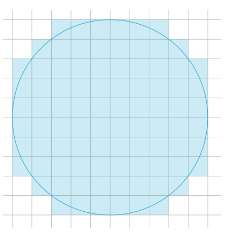

# Lab1

Calculate number of pixels(grids) covers by a circle with radius `r` at (0, 0).

When `r = 5`, `pixels(r) = 88`.

## Basic

=4\times\sum_{x=0}^{r-1}\lceil\sqrt{r^2-x^2}\rceil)

Separate `r` calculations into `size` nodes.

See `v1.cc`.

## Improvement

### Done

1. Do not modulo every iteration. Modulo only once.
2. Calculate only 1/8 of the circles. Which reduce the amount of calculations by 1/2. See the GIF belows.
	
3. Do not calculate  every iteration, use subtraction to get the next .

### TODOs

- Do not do square root operation every iteration, replace it with subtraction.
